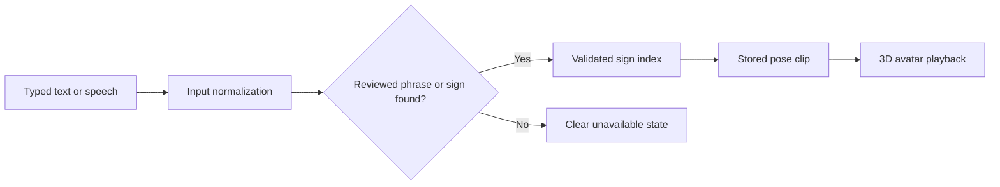

# ODYSSEY | Real-Time ISL Avatar

> Speech or text to validated Indian Sign Language pose playback on a custom 3D avatar.

[](https://mathewsvm-isl-avatar-mvp.static.hf.space/index.html?v=mobile-core-14)
[](#language-support)
[](#product-boundary)

**ODYSSEY** is a browser-based Indian Sign Language (ISL) demonstration built by **Team Odyssey**. A user can type a phrase or use speech input; the application normalizes the input, resolves only validated signs or reviewed phrases, and plays the corresponding stored pose clips through a 3D avatar.

## Live Demo

**[Launch ODYSSEY ISL MVP](https://mathewsvm-isl-avatar-mvp.static.hf.space/index.html?v=mobile-core-14)**

For the best mobile experience, allow the first page visit to finish loading. The app then caches its core runtime so later visits are substantially faster.

## What It Does

- Converts supported typed input into a sequence of validated sign-pose clips.
- Supports microphone transcription through the browser's speech-recognition capability.
- Handles reviewed English, Hindi, Malayalam, and Tamil meeting phrases.
- Normalizes common input variations such as `hai` to `hello`, `ar` to `are`, and `guys` to `everyone` where the meaning is unambiguous.
- Uses exact sentence clips when a reviewed sentence is available.
- Rejects unsupported content instead of substituting an unrelated gesture.
- Plays signs on a browser-native 3D avatar with adjustable playback speed and front, side, and debug views.
- Caches a compact, 25-sign core runtime with a service worker for faster repeat visits.

## How It Works



The system deliberately separates **lookup** from **animation**. It only animates a sign when there is a matching validated record in the runtime. That guard prevents a missing word from silently becoming a misleading sign.

## Product Surface

| Capability | Current behavior |
| --- | --- |
| Indexed sign and exact-sentence entries | 11,033 browser-ready records |
| Exact recorded multiword sentence clips | 100 entries |
| Core repeat-visit mobile cache | 25 common meeting signs |
| Deferred quick-start cache | 68 reviewed/demo signs |
| Avatar clip format | One selected 30-frame pose clip per resolved entry |
| Input languages | English, Hindi, Malayalam, Tamil |
| Unknown content | Explicitly reported; no fallback sign is played |

## Try These Inputs

These are useful quick checks for the hosted demo:

```text
hai all
thank you everyone
please mute your microphone
how are you
i am fine
see you tomorrow
have a good day
```

The app supports more entries than this list, but this is a deliberately reviewed set for a reliable demonstration. A phrase with unknown content is expected to be rejected rather than partially signed.

## Language Support

| Language | Support model |
| --- | --- |
| English | Validated word and phrase lookup with normalization |
| Hindi | Reviewed phrase mapping to ISL gloss records |
| Malayalam | Reviewed phrase mapping to ISL gloss records |
| Tamil | Reviewed phrase mapping to ISL gloss records |

Regional-language input is intentionally restricted to reviewed phrases. This avoids claiming a general-purpose translation system when the available runtime does not prove that capability.

## Run Locally

### Use the Hosted Static MVP

No installation is needed. Open the [live demo](https://mathewsvm-isl-avatar-mvp.static.hf.space/index.html?v=mobile-core-14) in a modern browser.

### Run the Full Local API Mode

The repository includes the Python server and source code. The full local API additionally needs the quality-filtered pose-shard runtime, which is intentionally hosted outside GitHub because it is approximately 2.1 GB.

```powershell
git clone https://github.com/MathewsV-Manoj/isl-avatar-mvp.git
cd isl-avatar-mvp

py -3.11 -m venv isl_env
.\isl_env\Scripts\Activate.ps1
pip install huggingface_hub

# After placing the runtime pose shards beside this project:
.\start_product.ps1
```

Then open `http://127.0.0.1:8080/isl-avatar-prototype.html`.

### Run the Release Checks

```powershell
.\run_product_preflight.ps1
python .\test_input_normalization.py
python .\test_static_runtime_export.py
```

## Repository Map

```text
.
├── isl-avatar-prototype.html        # Main browser experience and avatar rig
├── production_server.py             # Local validated-lookup API
├── regional_translation.py          # Reviewed multilingual phrase mappings
├── runtime_*.json                   # Compact browser runtime indexes
├── signal_dictionary.json           # Small validated local dictionary index
├── deployment/                      # Static-release and backend handoff files
│   ├── static_frontend/             # Deployable static web bundle
│   └── RELEASE_CHECKLIST.md         # Backend/frontend release guidance
├── test_*.py                        # Product and runtime regression checks
└── build_*, extract_*, train_*.py   # Dataset, pose, and model pipeline tools
```

## Deployment

The current public build uses:

- **Hugging Face Static Space** for the web app.
- **Hugging Face Dataset repository** for the browser runtime and pose media.
- A service worker for repeat-visit caching.

For a split backend deployment, see [deployment/README.md](deployment/README.md) and [deployment/RELEASE_CHECKLIST.md](deployment/RELEASE_CHECKLIST.md). The included `vercel.json` is suitable for serving the static frontend, but Vercel Functions are not suitable for the full pose-shard runtime.

## Data and Repository Policy

The raw downloaded datasets, model checkpoints, local virtual environment, logs, and large derived training artifacts are intentionally excluded by `.gitignore`.

This keeps the GitHub repository compact and reproducible while preventing accidental publication of large files or data whose redistribution terms may differ by source. The hosted runtime contains only the selected browser assets needed by the MVP.

## Product Boundary

ODYSSEY is a **validated lookup and recorded-pose MVP**. It is not a claim of:

- universal vocabulary coverage;
- unrestricted English, Hindi, Malayalam, or Tamil to ISL translation;
- semantic or grammatical ISL correctness for every sentence;
- independent ISL signer validation; or
- suitability for accessibility-critical communication without expert review.

Independent evaluation by ISL signers is required before representing the product as linguistically validated or using it in high-stakes communication.

## Team

Built by **Team Odyssey**.

For source, setup, and deployment details, start with this README and the files in [`deployment/`](deployment/).
