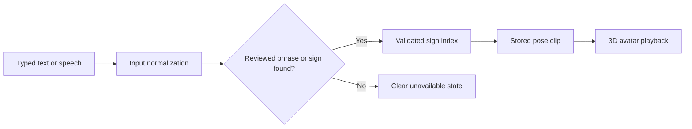

# Indian Sign Language Interpreter

> A browser-based interpreter prototype that turns supported speech or text into validated Indian Sign Language pose playback on a custom 3D avatar.

[](https://mathewsvm-isl-avatar-mvp.static.hf.space/index.html?v=mobile-core-14)
[](#language-support)
[](#product-boundary)

The **Indian Sign Language Interpreter** is a browser-based ISL demonstration developed by **Team Odyssey**. A user can type a phrase or use speech input; the application normalizes the input, resolves only validated signs or reviewed phrases, and plays the corresponding stored pose clips through a 3D avatar.

## Live Demo

**[Launch the Indian Sign Language Interpreter](https://mathewsvm-isl-avatar-mvp.static.hf.space/index.html?v=mobile-core-14)**

For the best mobile experience, allow the first page visit to finish loading. The app then caches its core runtime so later visits are substantially faster.

## The Problem

Everyday conversations, classroom explanations, and online meetings move quickly. Deaf and hard-of-hearing participants may face a communication gap when an interpreter is unavailable, especially for short, repeated interaction patterns such as greetings, requests for clarification, meeting instructions, and common conversational phrases.

Many demonstration systems fail in two ways: they show a default animation for unknown input, or they overstate what a small dictionary can translate. Both problems reduce trust. A credible prototype must be transparent about what it understands, respond quickly to known input, and refuse unsupported input clearly.

## Our Solution

The Indian Sign Language Interpreter uses a **guarded retrieval pipeline** rather than inventing gestures for unsupported text. Its design objective is simple: only show a sign when the runtime has a validated record for it.

1. Capture typed text or browser speech transcription.
2. Normalize harmless spelling, punctuation, contraction, and greeting variants.
3. Match reviewed phrases first, then resolve the longest available validated sign labels.
4. Retrieve the stored pose clip associated with each resolved label.
5. Retarget the pose sequence to the browser avatar and animate it at the selected speed.
6. Stop with a clear unavailable state when content is not covered, rather than guessing.

## What It Does

- Converts supported typed input into a sequence of validated sign-pose clips.
- Supports microphone transcription through the browser's speech-recognition capability.
- Handles reviewed English, Hindi, Malayalam, and Tamil meeting phrases.
- Normalizes common input variations such as `hai` to `hello`, `ar` to `are`, and `guys` to `everyone` where the meaning is unambiguous.
- Uses exact sentence clips when a reviewed sentence is available.
- Rejects unsupported content instead of substituting an unrelated gesture.
- Plays signs on a browser-native 3D avatar with adjustable playback speed and front, side, and debug views.
- Caches a compact, 25-sign core runtime with a service worker for faster repeat visits.

## How It Works



The system deliberately separates **lookup** from **animation**. It only animates a sign when there is a matching validated record in the runtime. That guard prevents a missing word from silently becoming a misleading sign.

## Product Surface

| Capability | Current behavior |
| --- | --- |
| Indexed sign and exact-sentence entries | 11,033 browser-ready records |
| Exact recorded multiword sentence clips | 100 entries |
| Core repeat-visit mobile cache | 25 common meeting signs |
| Deferred quick-start cache | 68 reviewed/demo signs |
| Avatar clip format | One selected 30-frame pose clip per resolved entry |
| Input languages | English, Hindi, Malayalam, Tamil |
| Unknown content | Explicitly reported; no fallback sign is played |

## Engineering Architecture

The application is designed as a lightweight browser experience with an auditable sign-selection layer.

| Layer | Responsibility | Implementation |
| --- | --- | --- |
| Interaction | Text entry, microphone control, language selector, speed control | Responsive HTML, CSS, and browser APIs |
| Language guard | Normalization, phrase matching, unknown-input rejection | Deterministic JavaScript and Python rules |
| Sign index | Maps reviewed labels to validated clip metadata | 11,033-entry runtime index |
| Pose delivery | Loads only the required clips instead of the full corpus | Lazy-loaded JSON pose assets |
| Avatar renderer | Converts landmark poses to arm, wrist, palm, and finger movement | Custom 3D browser rig |
| Repeat-visit cache | Keeps the application shell and core signs available after first visit | Service worker plus compact bootstrap runtime |

### Mobile performance strategy

The deployed browser app avoids loading the entire pose corpus on every visit:

- A **4.85 MB bootstrap runtime** contains the full index plus 25 high-frequency signs.
- A deferred **8.99 MB quick-start cache** adds 68 reviewed demonstration signs.
- The remaining pose clips are fetched only when a resolved sign requires them.
- The service worker caches the application shell and bootstrap runtime after the first successful visit.

This makes common repeat interactions noticeably faster while keeping the overall runtime data separate from the Git repository.

## Verification and Benchmarks

The following figures are **reproducible engineering checks**, not a claim of linguistic accuracy. They measure whether a covered input resolves to the intended stored record and whether that record can be delivered to the avatar pipeline.

| Evaluation | Result | What it verifies |
| --- | --- | --- |
| English acceptance suite | **25 / 25 passed (100%)** | Reviewed English phrases resolved to retrievable stored clips |
| Reviewed Hindi, Malayalam, and Tamil suite | **60 / 60 passed (100%)** | Reviewed regional phrases mapped to their intended English/ISL lookup paths |
| Input-normalization regression | **16 / 16 passed (100%)** | Common speech-like spelling, contractions, and greeting variants resolve consistently |
| Multilingual mapping regression | **10 / 10 passed (100%)** | Representative reviewed language mappings produce the expected English phrase |
| Static runtime contract | **11,033 indexed records** | Browser runtime index, bootstrap payload, and deployment assets remain consistent |
| Quick-start clip integrity | **68 cached clips** | Every cached clip contains a non-empty 30-frame pose sequence |
| Core bootstrap integrity | **25 cached signs** | Core cache can provide a first responsive interaction path |

### Quality controls

- Each accepted pose clip is checked for the expected landmark-array structure before release checks pass.
- The source-quality gate rejects a label when its best stored take has both hands collapsed for more than half its frames.
- Five CISLR labels and five iSign labels were excluded by this quality gate in the local candidate inventory.
- The ISL500 supplemental source is not used for serving because its audit found collapsed hands in 9,436 of 14,220 frames.
- Browser smoke checks cover front view, arm motion, hand pose, playback speed, lazy clip loading, and debug-rig output.
- Unknown words remain visible as unavailable instead of silently triggering a different sign.

### Interpreting the numbers correctly

The 100% values above mean the system successfully retrieved and delivered clips for the **fixed reviewed test suites**. They do **not** establish 100% ISL semantic correctness, signer intelligibility, general sentence translation accuracy, or coverage of arbitrary vocabulary. Those require an independently labelled test set and evaluation by qualified ISL signers.

## Try These Inputs

These are useful quick checks for the hosted demo:

```text
hai all
thank you everyone
please mute your microphone
how are you
i am fine
see you tomorrow
have a good day
```

The app supports more entries than this list, but this is a deliberately reviewed set for a reliable demonstration. A phrase with unknown content is expected to be rejected rather than partially signed.

## Language Support

| Language | Support model |
| --- | --- |
| English | Validated word and phrase lookup with normalization |
| Hindi | Reviewed phrase mapping to ISL gloss records |
| Malayalam | Reviewed phrase mapping to ISL gloss records |
| Tamil | Reviewed phrase mapping to ISL gloss records |

Regional-language input is intentionally restricted to reviewed phrases. This avoids claiming a general-purpose translation system when the available runtime does not prove that capability.

## Run Locally

### Use the Hosted Static MVP

No installation is needed. Open the [live demo](https://mathewsvm-isl-avatar-mvp.static.hf.space/index.html?v=mobile-core-14) in a modern browser.

### Run the Full Local API Mode

The repository includes the Python server and source code. The full local API additionally needs the quality-filtered pose-shard runtime, which is intentionally hosted outside GitHub because it is approximately 2.1 GB.

```powershell
git clone https://github.com/MathewsV-Manoj/isl-avatar-mvp.git
cd isl-avatar-mvp

py -3.11 -m venv isl_env
.\isl_env\Scripts\Activate.ps1
pip install huggingface_hub

# After placing the runtime pose shards beside this project:
.\start_product.ps1
```

Then open `http://127.0.0.1:8080/isl-avatar-prototype.html`.

### Run the Release Checks

```powershell
.\run_product_preflight.ps1
python .\test_input_normalization.py
python .\test_static_runtime_export.py
```

## Repository Map

```text
.
├── isl-avatar-prototype.html        # Main browser experience and avatar rig
├── production_server.py             # Local validated-lookup API
├── regional_translation.py          # Reviewed multilingual phrase mappings
├── runtime_*.json                   # Compact browser runtime indexes
├── signal_dictionary.json           # Small validated local dictionary index
├── deployment/                      # Static-release and backend handoff files
│   ├── static_frontend/             # Deployable static web bundle
│   └── RELEASE_CHECKLIST.md         # Backend/frontend release guidance
├── test_*.py                        # Product and runtime regression checks
└── build_*, extract_*, train_*.py   # Dataset, pose, and model pipeline tools
```

## Deployment

The current public build uses:

- **Hugging Face Static Space** for the web app.
- **Hugging Face Dataset repository** for the browser runtime and pose media.
- A service worker for repeat-visit caching.

For a split backend deployment, see [deployment/README.md](deployment/README.md) and [deployment/RELEASE_CHECKLIST.md](deployment/RELEASE_CHECKLIST.md). The included `vercel.json` is suitable for serving the static frontend, but Vercel Functions are not suitable for the full pose-shard runtime.

## Data and Repository Policy

The raw downloaded datasets, model checkpoints, local virtual environment, logs, and large derived training artifacts are intentionally excluded by `.gitignore`.

This keeps the GitHub repository compact and reproducible while preventing accidental publication of large files or data whose redistribution terms may differ by source. The hosted runtime contains only the selected browser assets needed by the MVP.

## Product Boundary

The Indian Sign Language Interpreter is a **validated lookup and recorded-pose MVP**. It is not a claim of:

- universal vocabulary coverage;
- unrestricted English, Hindi, Malayalam, or Tamil to ISL translation;
- semantic or grammatical ISL correctness for every sentence;
- independent ISL signer validation; or
- suitability for accessibility-critical communication without expert review.

Independent evaluation by ISL signers is required before representing the product as linguistically validated or using it in high-stakes communication.

## Team

Built by **Team Odyssey**.

| Team member | Team member |
| --- | --- |
| <br><strong>Rohan Fleny</strong> | <br><strong>Mathews V Manoj</strong> |
| <br><strong>Meria Rachel Binu</strong> | <br><strong>Jotham Koshy Philip</strong> |

For source, setup, and deployment details, start with this README and the files in [`deployment/`](deployment/).
